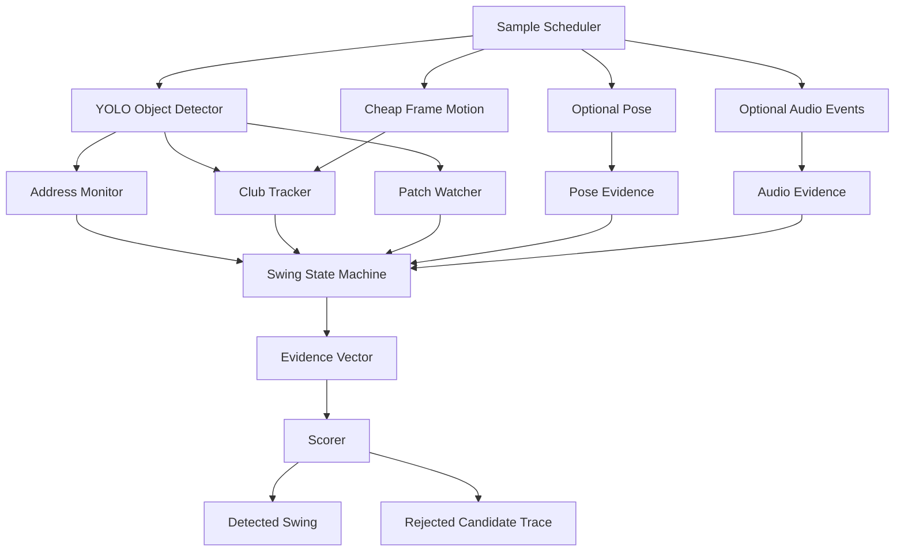
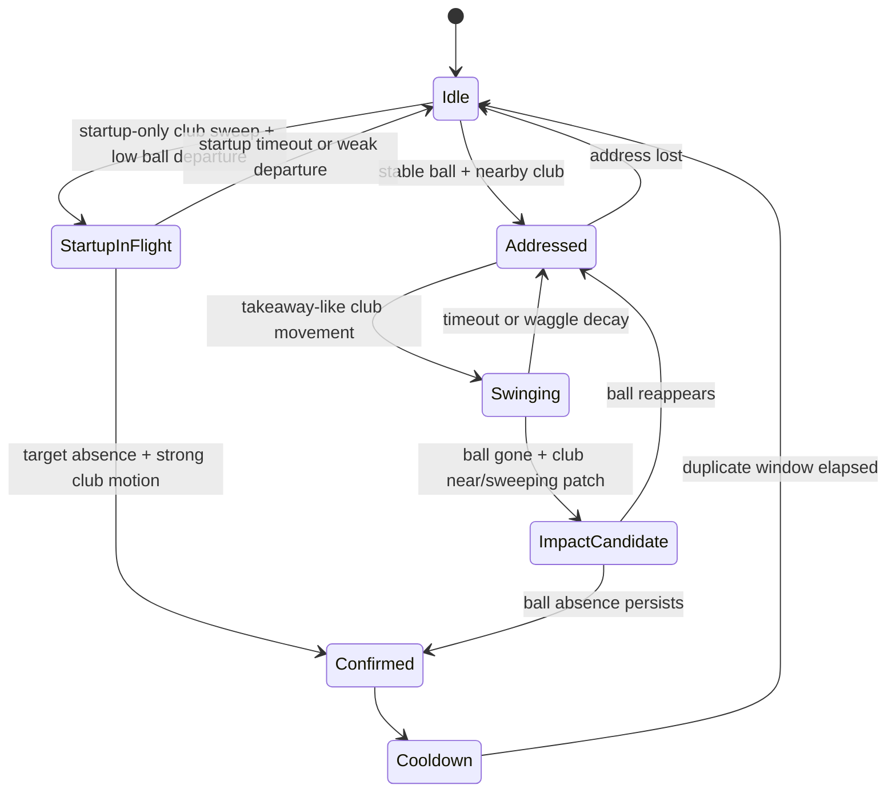

# Swing Detector Restart Design

This document is the target design for a cleaner on-device swing detector restart. It is not a description of the current production detector. The current implementation should be treated as a legacy baseline while this design is built and A/B tested beside it.

For the fixture-gated execution plan and milestone order, see [Swing Detector V2 Implementation Plan](/Users/ruari/Documents/Startups/SwingCoach/docs/SWING_DETECTOR_V2_IMPLEMENTATION_PLAN.md).

## Implementation Status

`SwingDetectorV2` is now the app-wired detector and the offline evaluator target:

- M0 scaffold and fail-fast dev loop: shared detector protocol, v2 Swift evaluator, Python fixture harness, JSON candidate traces, and contact sheets.
- M1 first pass: address lock, locked-patch watcher, graded club evidence, state-machine transitions, and evidence scoring.
- M2-M4 fixture gates and exported single-swing clip baselines are passing for the current labelled acceptance set.
- Capture, imported Trim detection, and Replay Debug now use V2 directly. The legacy detector source remains only as a reference/evaluator comparison path.

The central design choice is:

```text
Lock the addressed ball patch first.
Then detect a club-sweep and ball-departure state transition at that exact patch.
Use pose, audio, and global motion only as corroborating evidence.
```

## Current Diagnosis

The existing detector has useful signals, but the decision logic has become too branchy to reason about. The live detector currently combines object detections, rolling ball anchors, motion windows, direct contact checks, missed-contact allowances, clean-departure fallbacks, short-clip fallbacks, pose gates, cadence fallbacks, duplicate suppression, and fixture-specific timing concessions.

That shape creates the regression pattern we have seen:

- a threshold or OR-branch fixes one fixture
- the same change changes which branch wins on another fixture
- a detection can pass without it being obvious which physical fact was actually proven
- a rejection reason often reflects the last failed gate, not the full evidence profile

The reset should not start by tuning thresholds. It should change the shape of the detector so each physical claim is explicit, logged, and testable.

## First Principles

A real ball-striking golf swing is this sequence at one strike location:

1. A ball is stationary at address.
2. The club is associated with that ball.
3. The club moves away and returns through the strike zone.
4. The ball is gone from the same location and stays gone.
5. Optional corroborators, such as audio impact or body motion, agree with the timing.

Impact is a state transition, not a frame we expect to see. At 8-16 analyzed frames per real second, and especially with high-speed source video, the exact collision will usually be skipped. The detector should infer impact from:

```text
ball was here -> club swept through here -> ball is gone
```

The addressed ball location is therefore the most valuable object in the system. The design should stop asking "which of these balls is the real ball?" on every refresh. It should answer that once during address, lock a patch, and then watch that patch.

## Design Goals

- High precision first. Early versions should prefer missed detections over false positives. A miss on a clean single-swing clip is still a hard stop, not an acceptable trade.
- Every miss must be explainable by one or more evidence values, cross-checked against the actual frames.
- The live and offline/imported paths must use the same detector core. Offline mode should feed decoded frames through the same state machine.
- All time-based logic is defined in real swing-time and scaled to the source timeline (see Timeline And Source Frame Rate). The detector must never assume the source plays at real-time speed.
- Swings are de-duplicated by time, never by screen location. A new ball may be addressed anywhere; consecutive swings (for example driver then iron) will not share a position and must each lock their own fresh address.
- During development, every evaluated candidate (accepted or rejected) emits an offline trace. This is a debugging artifact, not an in-app or on-phone feature.
- Adaptive high-rate sampling should be rare, short, and state-driven.
- Audio and pose should not create detections by themselves.
- No fixture-specific rescue branches in the decision engine.

There is intentionally no second heavy pass and no backward re-processing buffer. Live capture is a single real-time pass and its results are final when recording stops. Imported clips are not latency-constrained, so the same single pass may simply sample more densely, but it is still one pass.

## Timeline And Source Frame Rate

The detector must handle several source timelines, and this is not optional polish. Test footage already mixes them.

- Real-time clips recorded at normal speed (around 30 fps), playing at `1x`.
- High-speed clips recorded at 120 fps and exported slowed to `4x`, so slow motion is visible on playback.
- High-speed clips recorded at 240 fps and exported slowed to `8x`.

A swing takes roughly 1.0-1.5 seconds of real wall-clock time. On a real-time clip that is about 1.2 seconds of playback. On an `8x` 240 fps export the same swing occupies about 9-12 seconds of playback. Any constant written in playback seconds is therefore meaningless on its own.

Rule:

```text
Define every duration in real swing-time.
Convert source timestamps into a real-time domain before the state machine sees them
  (real_time = source_time / timelineScale).
Run all logic, sampling, and evidence in real-time seconds.
Map accepted swing times back to the source timeline only for trim and display.
```

This applies to burst duration, confirmation persistence, cooldown / de-duplication gap, disappearance windows, and "stationary at address" windows.

The detector must know `timelineScale` for each input:

- Live capture knows it from the capture format.
- Imports must detect or be told it. Replay Debug already exposes `30/1x`, `120/4x`, `240/8x`.

Sample rate is also defined in real-time fps. On a slowed export, one real swing-second spans more source frames, so the scheduler can sample more source frames per real second while still respecting the analyzed-frames-per-real-second budget. Every test clip must have its true capture fps and `timelineScale` documented (see Testing And Debugging), because feeding a slow-motion clip to the detector as if it were real-time will silently break every duration.

## System Overview



The important shift is that the state machine owns timing and adaptive sampling. The scorer owns final acceptance. Trackers only produce evidence.

## Core Components

### Sample Scheduler

The scheduler decides which frames receive YOLO inference.

Default behavior:

- low rate while idle or addressed, around 4-8 fps
- high rate during the initial startup grace period, because live recording may
  begin already addressed or mid-swing
- high rate after a locked address plus a takeaway-like club movement
- high-rate burst lasts roughly 1.0-1.5 real seconds unless impact confirmation is actively pending
- immediate decay back to low rate after confirmation, timeout, or rejection

The trigger should not be generic motion. A high-rate burst is expensive and should require a rare, golf-specific state:

```text
startup grace OR (address locked AND club leaves the lock region in a takeaway-like direction)
```

### Address Monitor

The Address Monitor finds the strike location.

It should lock an address when a candidate ball:

- is low enough in frame to be plausible
- is stable for a short window
- has enough detection confidence or patch-level visual stability
- has clubhead or shaft evidence nearby
- has address-window endpoint coupling: the clubhead, or a compact inferred
  shaft endpoint, must be coupled to the locked ball patch before address is
  armed
- is associated with the primary golfer if pose is available

For club association, proximity is measured from the addressed ball to the
clubhead/shaft box. Stability then tracks the nearest point on that winning
club box to the ball, not the center of the whole box. This matters for shaft
boxes: a shaft can overlap the ball while the box center sits halfway up the
shaft, so using the center makes a stable club look like it jumped between
shaft and clubhead.

This generic box association is not enough by itself. A broad shaft detection
can pass near a ball during a practice setup, so address creation also requires
endpoint coupling inside the address window. Real clubhead detections are
preferred. Shaft-only address can still pass, but only when the shaft box is
compact enough that its nearest point is a plausible inferred endpoint rather
than a large rectangle covering half the mat.

Output:

```text
AddressLock {
    patchRect
    ballCenter
    lockedAt
    stabilityScore
    clubAssociationScore
    endpointCouplingScore
}
```

Once locked, the detector should primarily watch that patch. Global ball detection remains useful for finding a new address after a swing, but not for re-deciding the active strike spot every frame.

An address lock is not permanent. While the state machine is still in
`addressed`, the lock must keep seeing periodic endpoint coupling to the same
ball patch. If the club endpoint stays away from the patch for longer than the
hold gap, the lock is invalidated and the detector must find a fresh address.
Once the state machine has entered `swinging`, this hold monitor no longer
applies because the club is expected to leave the ball during takeaway.

Retargeting has hysteresis. After the lock switches to a newly preferred ball,
the detector holds that choice briefly instead of allowing frame-by-frame
bouncing between adjacent range balls. On multi-ball mats, neighbouring balls
can trade tiny clubhead-association advantages across sampled frames; hysteresis
keeps the detector watching the ball it just selected long enough for the
strike/no-strike evidence to resolve.

### Patch Watcher

The Patch Watcher answers a smaller question:

```text
Is the ball still present in this locked patch?
```

Inside the locked patch, the detector can be more permissive than the global model:

- lower YOLO ball threshold inside the patch
- use local luma/texture stability as weak presence evidence
- tolerate temporary club occlusion
- require disappearance persistence before declaring departure

This handles cases where the global ball model misses a yellow, covered, small, or low-contrast ball. The address lock supplies context that makes weak in-patch evidence useful without trusting weak detections globally.

Critical timing rule: at the moment of the strike the clubhead box sits on top of the patch, so the ball reads as absent purely because the club is occluding it. A club crossing the patch during a practice swing or waggle produces the same transient absence. Departure must therefore be confirmed by absence that **persists after the clubhead has left the patch region**, not absence measured while the club is still over it. The Patch Watcher should expose presence per frame plus whether the club currently overlaps the patch, so the state machine only counts post-sweep frames toward `disappearancePersistence`.

### Club Tracker

The Club Tracker should track:

- best clubhead point when visible
- shaft/club boxes when clubhead is missed
- distance to the locked patch
- path span
- vertical travel
- local speed around the patch
- whether the club swept through the strike zone

It should not decide whether a swing occurred. It should emit **continuous** evidence in `[0, 1]`, never booleans:

```text
clubNearPatch      // how close the club came to the patch, ramped 0..1
clubSpeedNearPatch // club speed while near the patch, ramped 0..1
takeawayScore      // how much the club moved away from the patch (takeaway-ness)
sweepScore         // how strongly the club returned through the patch at speed
arcScore           // backswing/downswing/follow-through path shape and span
```

Note these are graded, not `takeawayDetected` / `downswingSweepDetected` style flags. See Graded Outputs below for why.

The takeaway signal must be **direction-agnostic**. Down-the-line versus face-on, and right- versus left-handed golfers, all flip the "up and back" direction, so `takeawayScore` should measure the club leaving the patch and accelerating, not a specific screen direction. The Address Monitor may infer orientation later, but the trigger must not bake in a direction.

### Pose Evidence

Pose is a corroborator. It can help select the primary golfer and reject clear non-golfer motion, but it should not be a hard primary gate in the first rebuild.

Useful pose features:

- primary golfer continuity
- hands moved from address to finish
- body drift is not extreme
- golfer exists near the locked strike location

Pose should be allowed to be absent. A visually strong ball-and-club impact should not fail only because Apple Vision missed wrists.

### Audio Evidence

Audio is also a corroborator.

Good use:

```text
visual impact candidate at T
audio transient within +/- X ms
raise confidence or sharpen impact time
```

Bad use:

```text
audio transient alone
create swing detection
```

Nearby bays, mat strikes, bags, speech, wind, and slow-motion export artifacts make audio unsafe as a standalone detector.

## State Machine



State responsibilities:

| State | Sample Rate | Entered When | Watches For | Exit Reason |
| --- | --- | --- | --- | --- |
| Idle | Startup high, then low | Startup or after cooldown | Stable low ball plus nearby club; startup-only in-flight sweep/departure | Address lock, startup in-flight candidate, or no evidence |
| Addressed | Low | Address lock acquired | Club leaving patch in takeaway-like pattern | Swinging, address lost, timeout |
| StartupInFlight | Startup high | Recording began with swing already underway | Low ball anchor near early club sweep, then target departure | Confirmed or abandoned |
| Swinging | High burst | Takeaway detected | Club returning through patch, ball departure | ImpactCandidate or decay |
| ImpactCandidate | High until resolved | Ball gone near club sweep | Persistent absence or reappearance | Confirmed or rejected |
| Confirmed | Low | Impact accepted | Emit detection and trace | Cooldown |
| Cooldown | Low | Detection emitted | Duplicate suppression | Idle |

This state machine is also the adaptive-FPS controller. High-rate sampling exists during startup grace, `Swinging`, and unresolved `ImpactCandidate`. Startup grace can raise sampling rate, but it cannot force sampling back down; once the normal state machine arms a swing, the normal burst budget owns the high-rate window.

Startup grace is a parallel recovery path, not a replacement for address lock. The normal address detector still runs from frame one. If address lock succeeds, the regular `Addressed -> Swinging -> ImpactCandidate` path remains authoritative. If recording starts after address or during takeaway, `StartupInFlight` may infer a temporary strike anchor from early low-ball candidates plus strong club sweep/arc and target-patch departure. This path is time-bounded to the first seconds of recording and is intentionally stricter about club motion/departure because it lacks mature address history.

Slow-tempo drill swings may remain in `Swinging` beyond the normal timeout only when the source is slow-motion, the candidate has high prior arc evidence, and it has weak normal swing-sequence evidence. This handles rehearsed top-of-backswing/drop-and-release drills, including brief pauses, without globally extending waggles or real-time practice swings because the extension is hard-capped and shape-gated.

When a delayed drill swing resolves, final scoring may use the best sweep/arc/sequence evidence accumulated while `Swinging`, not only the local frames around disappearance. The same accumulated evidence is not used for ordinary candidates; they still need local club-through-ball evidence near the target departure.

Swing-phase ball retargets are also quality-gated at scoring time. A retargeted address ball must remain strongly coupled to the inferred club endpoint; weak retargets stay visible in traces but cannot become accepted detections.

## Graded Outputs

Every component emits continuous scores in `[0, 1]`. Only the final scorer compares to a threshold.

This is the same discipline as the OR-branch fix, applied one level down. If a component collapses to a boolean internally, for example `clubSweptThrough = clubSpeed > 0.3 && distance < 0.08`, it has buried a threshold inside itself. A missed swing then reads `clubSweptThrough = 0` and you cannot tell whether the club was nowhere near the patch or just under the line. The gradient that makes tuning and debugging possible is gone, and you are back to scattered hidden cutoffs.

So: components output smooth scores (for example `clubSweptThrough = proximityScore * speedScore`, each ramped 0..1). The state machine may still act on a coarse internal trigger for scheduling, such as boosting fps once takeaway-ness crosses a rough level, because that is only a scheduling hint and not the accept decision. The evidence that feeds acceptance stays continuous.

## Evidence Vector

The final decision should be based on a flat evidence vector instead of a chain of OR-branches.

| Evidence | Measures | Why It Matters | Missing Value |
| --- | --- | --- | --- |
| `anchorStability` | How confidently the addressed ball patch was locked | Rejects spare balls and background balls | `0` if no lock |
| `disappearancePersistence` | Ball gone from the locked patch and did not reappear | Separates impact from temporary occlusion | `0` if ball reappears |
| `clubSweptThrough` | Club passed through or very near the patch at strike speed | Attributes departure to this golfer's club | `0` if club absent |
| `swingArc` | Takeaway, downswing, follow-through shape and path span | Separates strike from nudges and setup movement | `0` if no arc |
| `swingSequence` | Ordered near -> away -> near club motion around the locked target | Rejects ball-positioning nudges that move a ball without a swing | `0` if no ordered sequence |
| `ballInventoryDrop` | Low strike-area ball count dropped after the candidate impact | Distinguishes real target departure from local patch occlusion | `0` if the count does not drop |
| `audioTransient` | Sharp audio event near candidate impact | Optional timing corroboration | `0` when audio unavailable |
| `poseConsistency` | Primary golfer exists and body/hands change plausibly | Optional golfer corroboration | `0` when pose unavailable |

Start with a hand-set weighted score. Missing corroborators must be treated as **neutral (excluded), not as zero**. A silent clip or a clip where Apple Vision missed the wrists should not be penalized for lacking evidence it could never have produced. Scoring a missing corroborator as `0` would cap an otherwise perfect strike below threshold and create a systematic recall hole on exactly the silent screen-recordings we already know are hard.

So the score is a weighted average over the evidence that is actually available:

```text
weights:
    anchorStability          0.22   // always present
    disappearancePersistence 0.26   // always present
    clubSweptThrough         0.34   // always present
    swingArc                 0.10   // always present
    swingSequence            0.16   // present for resolved candidates
    ballInventoryDrop        0.12   // present for resolved candidates
    audioTransient           0.04   // present only if audio was sampled
    poseConsistency          0.04   // present only if pose was sampled

available = the evidence terms that were actually produced for this candidate
score = sum(weight_i * evidence_i for i in available)
      / sum(weight_i           for i in available)

accept if score >= threshold
```

The visual terms are always present once a candidate impact is resolved; audio and pose drop out of both the numerator and the denominator when unavailable. The exact weights are starting placeholders, not truth. The design value is that strictness becomes one operating threshold, not dozens of interacting boolean branches.

The current v2 lock/impact contract is stricter than local disappearance alone:

- a stable address lock must match a current-frame low strike-area ball, not only a stale recent-window cluster
- a stable address lock must show clubhead or compact inferred-endpoint coupling to that current-frame ball
- the locked target patch must be occupied before impact and empty after the club leaves the patch
- the broader low strike-area ball inventory should drop after impact
- the club path must show ordered near -> away -> near sequence, so nudging or dragging balls with the club does not count as a swing
- accepted candidates must retain minimum disappearance persistence and swing sequence evidence; a high weighted score cannot rescue a candidate with no ordered swing path or weak sustained departure
- startup in-flight candidates are exempt from mature address history, but only inside the startup grace window and only when the temporary low-ball anchor shows target-patch departure plus strong club sweep/arc evidence
- clips that end at impact without enough post-impact frames are not acceptance targets for V2; the detector requires visible departure/persistence evidence rather than accepting contact motion alone

Once there are enough labelled positives and hard negatives, replace the hand-set weights with a tiny logistic regression over the same features. Keep it interpretable. The model should learn this small evidence vector, not become an opaque end-to-end video detector.

## Debug Trace

"Candidate" is an internal concept only: it is whatever the detector is currently evaluating before it decides to accept. It is not a product feature and is not surfaced on the phone or in any on-device debug page. The trace below is a development artifact written during offline evaluation runs, paired with contact sheets (see Testing And Debugging). The numbers complement the images; the images are what you actually look at.

During development, every evaluated candidate, accepted or rejected, emits a trace:

```json
{
  "candidateId": "uuid-or-sequence",
  "stateReached": "ImpactCandidate",
  "impactTime": 42.12,
  "addressLock": {
    "lockedAt": 40.88,
    "center": [0.54, 0.82],
    "stabilityScore": 0.91
  },
  "evidence": {
    "anchorStability": 0.91,
    "disappearancePersistence": 0.87,
    "clubSweptThrough": 0.74,
    "swingArc": 0.42,
    "audioTransient": 0.00,
    "poseConsistency": 0.28
  },
  "score": 0.72,
  "decision": "accepted",
  "primaryFailure": null
}
```

For rejection, `primaryFailure` should be derived from the evidence profile:

- `no_address_lock`
- `address_lost`
- `temporary_occlusion`
- `ball_reappeared`
- `no_club_sweep`
- `low_swing_arc`
- `duplicate`
- `timed_out`

The trace is read alongside the contact sheet for the same window. Together they tell us whether the address lock, patch watcher, club tracker, scorer, or labels need work. The trace alone is not the debugging product; the trace plus the visual frames is.

## Detection Algorithm Sketch

```swift
for sample in scheduledSamples {
    let objects = yolo.detect(sample)
    let motion = frameMotion(sample)
    let pose = poseSampler.maybeSample(sample)
    let audio = audioBuffer.eventsNear(sample.time)

    addressMonitor.update(objects, motion, pose)
    clubTracker.update(objects, motion, addressMonitor.currentLock)
    patchWatcher.update(sample, objects, addressMonitor.currentLock)

    let stateEvent = stateMachine.update(
        address: addressMonitor.output,
        club: clubTracker.output,
        patch: patchWatcher.output,
        pose: pose,
        audio: audio
    )

    sampleScheduler.update(stateMachine.state)

    if stateEvent == .impactCandidateResolved {
        let evidence = evidenceBuilder.build(...)
        let result = scorer.score(evidence)
        candidateLogger.record(result)

        if result.accepted {
            emitDetectedSwing(result)
        }
    }
}
```

Offline/imported detection should run the same loop. The only difference is that the sample scheduler reads from a video file instead of camera buffers.

## Handling Truncated Imports

Live capture should use the strict address-lock path. It usually sees setup before the swing.

Imported clips may start mid-swing. That creates a real fork:

1. Strict mode: no address lock means no detection. Highest precision.
2. Soft-address mode: infer a temporary strike patch from a stationary ball or from club sweep plus ball departure evidence. Lower precision.

This should not become a separate branch soup. It should be represented as a different scoring profile:

| Profile | Use Case | Required Evidence | Threshold |
| --- | --- | --- | --- |
| `strictLive` | New range recording | Address lock, departure, club sweep | High |
| `softImport` | Trim/imports that may start late | Strong departure, strong club sweep, optional audio/pose | Higher |
| `debugRecall` | Research only | Emits more rejected/low-score candidates | Low, not production |

The app can default live capture to `strictLive` and let Replay Debug compare profiles.

## Failure Ownership

| Failure | Owning Component | Expected Catch |
| --- | --- | --- |
| Repositioning ball with club | Club Tracker and `swingArc` | Slow club motion, no real arc |
| Club covers ball at setup | Patch Watcher | Ball reappears, so disappearance does not persist |
| Spare/alignment balls | Address Monitor | No nearby resting club association |
| Nearby golfer audio | Scorer | Audio cannot create detection without visual evidence |
| Yellow or partly covered ball | Patch Watcher | In-patch low-threshold/classical evidence can still see presence |
| Practice swing with no ball | Address Monitor or Patch Watcher | No locked ball or no ball departure |
| Waggle | State Machine | `Swinging` times out back to `Addressed` |
| Duplicate detection | Cooldown (time-based) | Impact within the cooldown window of a prior confirmed swing, judged by time only, never by screen location |
| Walking or body movement | Address Monitor and Club Tracker | No locked strike patch plus club sweep |

## Keep, Cut, Build

Keep:

- YOLO/Core ML golf-object model as the semantic anchor.
- Impact as ball disappearance plus club attribution.
- Adaptive sampling, but only after address plus takeaway.
- Audio and pose as optional corroborators.
- Candidate diagnostics, but make them evidence traces.
- Replay Debug and evaluator harnesses for A/B testing.

Cut from the new design:

- Fixture-specific rescue branches.
- Long-lookback anchor rebucketing as the primary active strike-location mechanism.
- Parallel live/offline detector logic that can drift.
- Pose as a hard acceptance gate.
- Audio-only detection.
- Global motion as proof of a swing.

Build:

- `AddressMonitor`
- `PatchWatcher`
- `ClubTracker`
- `SwingStateMachine`
- `EvidenceVector`
- `SwingScorer`
- `CandidateTrace`
- shared live/offline frame-feed harness

## Testing And Debugging

Testing is done against real recorded videos, not synthetic inputs. The detector only matters if it works on the actual capture and import footage.

### Fixture Inventory

The source of truth for fixtures is `detector_workbench/validation/labels/detector_test_v3_labels.json`, not this document. Each entry already records `source_time_scale` and the rough impact labels. Do not duplicate that into a second table that can drift; add new fields there if more metadata is needed.

Timeline convention, confirmed by `ffprobe`: every clip plays at roughly 30 fps. The timeline is determined entirely by `source_time_scale`:

```text
capture_fps  = playback_fps (~30) * source_time_scale
real_time_s  = source_time_s / source_time_scale
```

Active V3 set:

| Clip | playback fps | source_time_scale | implied capture | playback dur | real-time dur | impacts | type |
| --- | ---: | ---: | ---: | ---: | ---: | ---: | --- |
| `test2` | 30 | 1.0 | 30 (real-time) | 6s | 6s | 1 | single trimmed swing |
| `test12` | 30 | 1.0 | 30 (real-time) | 84s | 84s | 1 | short real-time |
| `test11` | 30 | 1.0 | 30 (real-time) | 204s | 204s | 3 | real-time session |
| `test7` | 30 | 1.0 | 30 (real-time) | 691s | 691s | 11 | long real-time session |
| `test14` | 30 | 8.0 | 240 | 1651s | 206s | 3 | 240fps @ 8x |
| `test5` | 30 | 8.0 | 240 | 2245s | 281s | 4 | 240fps @ 8x |
| `test10` | 30 | 8.0 | 240 | 2242s | 280s | 4 | 240fps @ 8x |
| `test13` | 30 | 8.0 | 240 | 2769s | 346s | 6 | 240fps @ 8x |
| `test4` | 30 | 8.0 | 240 | 4530s | 566s | 18 | 240fps @ 8x, longest |

Notes:

- No 120 fps / `4x` clip exists in the active set today. If one is added it must be recorded with `source_time_scale: 4.0`.
- `audio`, `view` (DTL / face-on), and `club` are not yet captured anywhere. If they matter for debugging, add them as fields in the labels JSON rather than here.
- `test1`, `test3`, `test6` are siloed under `.detectorTestV3/.silo` and excluded from active scoring.
- The set already mixes the dimensions that matter: real-time vs 240@8x, short single swings (`test2`) vs long sessions (`test4`, `test7`).

### Test Workflow

Build the first pass, then advance **one clip at a time, fail fast**:

1. Run the detector on the simplest single clean swing first (`test2`).
2. If it detects that swing correctly, move to the next clip.
3. If it misses, stop. A miss on an easy single-swing clip means the pass is not good enough to keep extending, so fix the cause before touching any harder clip.

This is deliberately not a "score the whole suite and tune to the average" loop. The point of the redesign is that a miss has one explainable cause, so chase that cause before moving on.

### Visual Debugging With Contact Sheets

The primary debugging tool is a contact sheet read alongside the metrics, not the metrics alone. Numbers say what the detector believed; the frames say what was actually true. Looking at both together is what catches the real fault.

For each labelled impact, and for each false positive, render a contact sheet of the sampled frames around that time, annotated with:

- YOLO boxes (clubhead, shaft, ball candidates)
- the locked address patch and ball center
- whether the club currently overlaps the patch
- per-frame ball-present-in-patch
- the per-frame evidence values and the state machine state
- the disappearance timeline (present -> club over patch -> absent -> persisted)

Then inspect visually. Typical reads:

- "the ball is clearly still sitting there at frame X but the patch watcher says absent" -> patch too small or in-patch threshold too high
- "the club box is nowhere near the patch but `clubSweptThrough` is 0.6" -> proximity or speed scoring is wrong
- "ball reads absent only while the clubhead covers it, then reappears" -> persistence must be measured after the club leaves (occlusion rule)
- "ball count drops but `swingSequence` is 0" -> likely ball positioning or dragging, not a near-away-near swing

### Per-Layer Metrics

Do not score only the final count. Score each layer so a miss is attributable.

For every labelled swing:

- Was an address lock found before impact?
- Did the locked patch show ball departure after the club left?
- Did club-sweep evidence exist near the departure?
- Did the candidate reach `ImpactCandidate` / `Confirmed`?
- What evidence values did it receive?
- Was the final score below threshold, and why?

For every hard negative:

- Did it create an address lock?
- Did it reach `Swinging`?
- Did it reach `ImpactCandidate`?
- Which evidence value was spuriously high?

### Run Artifacts

Per clip, an evaluation run should produce:

- a JSON debug trace (accepted and rejected candidates, evidence, `primaryFailure`) — debug only, never surfaced on the phone
- contact sheets for each impact and each false positive
- a summary line:

```text
case
expected swings
confirmed swings
missed labels
false positives
address-lock recall
departure recall
club-sweep recall
impact-time error (predicted vs labelled, in real-time ms)
mean score by class
top rejection reasons
processing FPS / lag
high-rate burst count and duration
```

Extend the existing harness (`detector_workbench/validation/evaluate_detector_test_v3_performance.py` and the V3 labels) rather than replacing it; add contact-sheet generation around impacts and false positives.

### Hard Negatives

The current V3 labels and exported library clips are useful, but the reset needs more hard negatives:

- ball repositioning
- club covering ball at setup
- practice swings with ball still present
- empty mat waggles
- spare balls and bucket balls
- nearby golfer audio
- walking into frame
- poor ball colors or partial occlusion
- truncated imports that start after address

## Incremental Build Plan

1. Freeze current detector as `legacy` for comparison.
2. Create the new component interfaces and traces with no scoring.
3. Implement strict address lock and patch watcher.
4. Implement club tracker and state machine.
5. Emit candidates and evidence vectors, but keep them debug-only.
6. Add the initial weighted scorer with a conservative threshold.
7. Add adaptive high-rate bursts after address plus takeaway.
8. Validate one clip at a time, fail fast: start at the simplest single swing, fix any miss before moving on, and only then widen to harder clips and A/B against the legacy detector.
9. Add soft-import profile only after strict live behavior is understandable.
10. Fit simple weights from labelled evidence once there is enough data.

## Open Decisions

- Should live capture require a hard address lock for all production detections?
- How short can the high-rate burst be without losing impact timing?
- Should patch watching include a classical fallback in v1, or start YOLO-only inside the patch?
- What is the production operating threshold for "safe precision"?

Resolved:

- No second pass and no backward re-processing buffer. Single real-time pass for live; imports are one pass that may sample more densely.
- The evidence trace is a development artifact only. Nothing about candidates is surfaced on the phone.
- Swing de-duplication is by time, never by location.
- Missing audio/pose are neutral (excluded from the score), not zero.

## Summary

The restart should be built around one physical invariant:

```text
The addressed ball patch changed because this golfer's club swept through it.
```

The detector should not ask a monolithic question like "did a swing happen?" It should build a trace of smaller claims: address lock, patch departure, club sweep, swing arc, optional audio, optional pose. The final decision should be a simple score over those claims, with every candidate logged.

That gives the project a detector that is conservative, debuggable, and capable of improving gradually without returning to threshold whack-a-mole.
