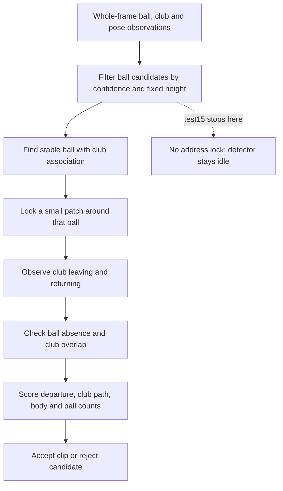

# How SwingDetectorV2 selects a ball and confirms a shot

Historical V2 source audit. The app now uses [SwingDetectorV3](./SWING_DETECTOR_V3.md); this page remains the evidence for why V2 was replaced.

For the 2026-08-31 investigation and replacement architecture, see [reconstructing swing detection around observable evidence](./SWING_DETECTOR_RECONSTRUCTION.md). V3 implements that direction; this page preserves V2 behavior and measured experiments.

Latest result, 2026-08-30: moving the line from 68% to **65%** matched **51/51 original swings and 2/3 test15 swings**, with **no extra detections** across all ten recordings. Every original recording's detections, candidate traces, and sampling rows exactly match the 68% baseline. Test15 still misses the second swing after a false clubhead detection causes a switch to its spare at y=66.1%. The 65% source and binary were isolated; product source remains at 68%. Adaptive placement and revised target/departure logic remain untested. See the [validation workflow](../detector_workbench/validation/README.md) for the full comparison.

The earlier 60% experiment matched 40/51 original swings and 2/3 test15 swings, with one extra. Moving to 65% excludes the harmful targets between y=60.9% and y=64.7% that caused the remaining original-suite regressions. This restores fixture performance without fixing the target-selection weakness. In inspected test15 frames, the real ball sits as little as six pixels below the 65% boundary at 1920-pixel image height. These recordings now inform threshold selection; recovery on them is not evidence of generalization to unseen camera framing.

Experiment results, 2026-08-30: removing the 68% position filter from ball selection and inventory improved test15 from **0/3 to 2/3**, with no extras, but regressed the original suite from **51/51 to 38/51**, with **13 misses and two extras**. Startup's distinct 58% candidate filter and all other rules remained unchanged. Test15's remaining miss switches to a spare ball after a false clubhead detection. All 13 original-suite misses switch from the addressed ball to above-line detections; probes confirm downrange targets in several cases. The extras expose unrelated ball-count evidence and body occlusion of a background target. The rule currently provides protection, although its fixed framing restriction remains a problem. The baseline code is restored and unchanged. See the [validation workflow](../detector_workbench/validation/README.md) for per-recording results and evidence.

Source audit dated 2026-08-30. This describes the pre-V3 implementation and separates it from proposed changes. The sibling detectSwings repository was inspected at `ca9f0ce`. No detector code or thresholds were changed for this audit.

The immediate finding is a camera-framing restriction, not a general absence of occlusion handling. SwingDetectorV2 already handles several forms of clubhead occlusion. However, its normal path first excludes every ball whose centre is above 68% of the image height. In test15, the struck balls sit around 65–66%, so those protections never get a selected target to work with.

The [restart design](./SWING_DETECTOR_DESIGN.md) records the intended architecture. Some of its intended behavior differs from the implementation described below.

## Three different detectors

| System | Purpose | Current approach |
| --- | --- | --- |
| App `SwingDetectorV2` | Retain swings during Capture, imported Trim detection, and Replay Debug | Select an addressed ball, watch its patch, check club motion and ball departure |
| detectSwings `detect_shots.py` | Collect real shots and practice swings from recorded footage, including YouTube | Track balls through the recording, examine disappearances, corroborate with pose, club motion, flight, and editorial evidence |
| P1–P10 event model | Estimate positions within a swing | Temporal model over pose and club features; its standard decoder assumes one swing per clip |

The third system generated the test15 P7 proposals. The user reviewed those before the app detector was tested. Accurate P7 proposals do not by themselves prove ball contact or establish a validated continuous-capture detector.

## What the app actually observes

The [V2 driver](../SwingCoach/Models/SwingDetectorV2/SwingDetectorV2.swift) runs these observations on sampled frames:

| Observation | Available information | Current use and limitation |
| --- | --- | --- |
| YOLO ball candidates | Bounding boxes, centres, sizes, confidence | Generic balls, not an identified addressed ball. Whole-frame inference retains up to 12 ball boxes after suppression. |
| YOLO clubhead and shaft | Bounding boxes and confidence | Proximity, movement, arc, and target association. A shaft box is not a segmented shaft or a measured club tip. |
| Apple Vision body pose | Recognized body joints | V2 retains a core-joint visibility fraction, mean wrist position, torso height, and wrist height relative to the hips. |
| Frame brightness change | Difference between downsampled successive frames | Motion evidence. This is not camera-motion compensation or a local ball template. |
| Recent sampled history | Objects, pose features, and motion over time | Stability, club path, disappearance, and before/after ball counts. |

V2 takes the first Vision body observation. It does not maintain an explicit golfer identity across frames or robustly associate every club with a tracked person. The ordinary `ClubTracker` prefers the strongest clubhead, falling back to a shaft box. Wrist-relative club attribution exists in the optional practice-swing path, not throughout the ordinary shot path.

Vision already recognizes more joints than V2 preserves. Ankles could be exposed from the existing request for a foot-relative search area. That requires feature plumbing and confidence handling, not necessarily another model. V2 does not currently understand the mat boundary, ground plane, depth, which range bay belongs to the golfer, or a ball's physical contact with the club. Production V2 supplies no audio evidence to its scorer.

## The normal shot path

1. **Sample in real swing time.** Defaults are 8 fps, with 16 fps during startup and swing bursts. The first two real seconds receive startup sampling. Source seconds are divided by `sourceTimeScale` before time-based decisions. For test15, eight playback seconds equal one real second.
2. **Select an addressed ball.** `AddressMonitor` considers balls with confidence at least 0.30 and centre `y >= 0.68`, measured from the image top. It groups nearby positions over the last 1.15 real seconds. The history must span at least 0.95 seconds. A ball must occur in at least 30% of those samples and match a detection in the current frame. Stability, quiet motion, persistent club proximity, and clubhead or compact shaft-endpoint association must also pass.
3. **Keep a target patch.** The patch expands the selected ball box, with minimum and maximum sizes. The detector watches that location rather than selecting a new ball on every frame. During address it tolerates temporary gaps in endpoint association, but invalidates a stale lock after 1.35 real seconds without enough coupling.
4. **Recognize club movement.** `ClubTracker` measures proximity, speed near the patch, path span, vertical travel, and ordered near → away → near movement. Takeaway does not require a particular left/right direction. Distance and arc thresholds are still largely fractions of the full image, not golfer size.
5. **Resolve a candidate.** After address and swing movement, an absent ball plus enough sweep and arc evidence starts an impact candidate. Reappearance cancels it. Resolution uses either five qualifying absent samples or 0.55 real seconds of absence; the qualifications and caveats are below.
6. **Accept or reject.** The driver combines target stability, target disappearance, club sweep, arc, ordered sequence, and ball-inventory change. The weighted score must reach 0.74. Mandatory checks additionally require sufficient target disappearance, a nonzero sequence, human presence, club presence, and strong coupling for a retargeted ball. This is not acceptance through one score threshold alone.
7. **Return a retained window.** Accepted output uses 1.6 real seconds before the estimated impact and 0.8 after it. A 1.5-second impact gap and lock suppression prevent duplicate captures and immediate re-locking on follow-through.

The main implementation is in [AddressMonitor](../SwingCoach/Models/SwingDetectorV2/AddressMonitor.swift), [ClubTracker](../SwingCoach/Models/SwingDetectorV2/ClubTracker.swift), [SwingStateMachine](../SwingCoach/Models/SwingDetectorV2/SwingStateMachine.swift), and [SwingDetectorV2](../SwingCoach/Models/SwingDetectorV2/SwingDetectorV2.swift).

## Where clubhead occlusion is already handled

The user's recollection is supported by both the design and the code. There are several protections, with different preconditions.

| Situation | Existing handling | Limit |
| --- | --- | --- |
| Ball flickers in and out before selection | The address history requires only 30% presence, rather than presence in every sample. Club association is evaluated over the history. | A current-frame ball detection is still required to create the lock, and the position filter runs first. |
| Clubhead covers an already selected ball at address | The lock can remain while club endpoint association persists. The addressed state waits while the patch reports no ball; it does not immediately declare a hit. | It cannot establish an ordinary ball lock from a ball that has never been detected. |
| Takeaway reveals a better target beside spare balls | `retargetCandidate` can change an existing lock using stronger current clubhead association and recent stability, with a hold interval to avoid bouncing between balls. | It needs an existing lock, a visible replacement ball, and the same height filter. |
| Club crosses the ball patch during a swing | `PatchWatcher` reports ball presence separately from club overlap. Overlap frames do not increment the state machine's absent-sample count. | The elapsed-time resolution path is less strict than the sample-count path. |
| Ball reappears after temporary covering | An unresolved impact candidate resets to addressed. Final departure evidence prefers post-impact frames without club overlap. | V2 does not perform the offline detector's long future reveal scan or later shot retraction. |

Relevant code: [PatchWatcher](../SwingCoach/Models/SwingDetectorV2/PatchWatcher.swift), `AddressMonitor.holdsAddress`, `AddressMonitor.retargetCandidate`, `SwingStateMachine.update`, and `SwingDetectorV2.departureEvidence`.

This distinction matters for test15. At the 68% baseline, there is no address lock because the balls fail the height filter. After removing or relaxing the line, two swings are recovered, while the second misses because the detector switches to the spare following a false clubhead detection. Existing occlusion handling does not prevent that wrong-target switch.

## Differences between the design and the code

These are source-level findings, not separately reproduced failures:

- The patch watcher declares a 0.15 ball-confidence threshold, but `GolfObjectDetector` discards detections below 0.25 first. The patch can use detections between 0.25 and the address selector's 0.30 threshold, but cannot recover detections between 0.15 and 0.25. There is no patch-specific inference pass or luma/template fallback.
- The design says disappearance must persist after the club leaves. The state machine skips overlap frames when counting absent samples, but can also resolve on elapsed absence time. `departureEvidence` prefers non-overlap frames, then falls back to all post frames if none are available. The implementation therefore does not strictly enforce that design rule in every path.
- The design describes pose as an optional corroborator. Ordinary and startup candidates actually require `presence.hasHuman`, based on enough frames with visible core body joints. A missing pose can reject an otherwise plausible shot.
- The intended primary-golfer association is incomplete. Normal address selection does not use the wrist or torso fields to choose the golfer's ball.

These should be kept visible when changing address selection. None has been fixed or tuned in this audit.

## Other paths in V2

**Startup recovery** considers short ball histories and strong sweep/departure evidence when recording begins mid-swing. It uses a more permissive ball-height threshold of 0.58. It examines possible impacts within the first 2.25 real seconds and resolves within 2.90 seconds. It cannot rescue test15's swings at about 19.57, 41.30, and 65.90 real seconds.

**Optional practice capture** recognizes a pose top → fast hand dip → held finish, with club detections near the wrists and distances scaled by torso height. It waits for finish evidence and skips patterns already covered by a contact detection. It does not prove ball contact. This path is off in the local baseline and is not an appropriate way to turn a missed real shot into a successful contact test.

## What detectSwings does differently

The offline [detect_shots.py](../../detectSwings/detect_shots.py) also has a fixed image-height rule. Its main ball-track path normally requires the ball below 66% of the image height.

It makes an exception when the image height/width ratio is greater than 1.85. In those unusually tall crops, a ball can pass if it is below the recent median wrist position by more than 0.8 median torso heights. This is already a body-relative ground check, but restricted by aspect ratio. test15 is upright 1080 × 1920, ratio 1.778, so that exception would not activate. This is a code-path observation, not a claim about a fresh offline detector run on test15; its other recovery paths may behave differently.

Other relevant offline mechanisms include:

- Ball tracks tolerate up to one second of missing detections and compensate for camera movement. Cuts terminate tracks.
- Candidate evidence is evaluated around a track's disappearance, with weak-address alternatives. It does not require the live app's mature address lock before the swing starts.
- Ball reappearance is checked over a short 2.5-second window and a longer 12-second reveal window. A fresh ball approaching the hitting spot can distinguish re-teeing from the original ball becoming visible again.
- Existing neighboring balls are recorded so they do not impersonate the target reappearing. Existing downrange balls are also recorded so they do not count as newly launched ball flight.
- Pose-relative club association and torso-scaled arc measurements help attribute movement to the golfer. Difficult candidates can trigger denser re-decoding around impact.
- A hidden-ball recovery path requires a full swing, a club associated with the golfer, and flight evidence or an editor's shot tracer. A club or pose pattern alone is insufficient to establish contact.

There is also a [streaming wrapper](../../detectSwings/stream_detect.py), so the repository is not exclusively offline anymore. It reuses the event logic over a trailing history. Constants permit shot emission around four seconds after impact, practice classification around six seconds, and later shot retraction up to about 13.5 seconds. The observed cadence can add delay. This is a different latency and finality contract from V2's single-pass capture path. Editorial tracers and retrospective dense re-decoding are not drop-in phone-camera features.

## What the history explains

- SwingCoach commit `bc6d07f`, 2026-05-31, introduced V2 with `minBallY = 0.68`. The comment specifies a low strike-area ball. The inspected record does not explain calibration of exactly 0.68.
- Commits `16a5707`, `e81b543`, and `ebfe605` tightened endpoint association, expired stale address locks, and stabilized multi-ball retargeting. Their documentation records concrete concerns about broad shaft boxes and adjacent balls. Removing those safeguards along with the height gate would discard deliberate protections.
- In detectSwings, commit `d8d94cd` changed a 0.55 height threshold to 0.66. Its comment explicitly mentions rejecting small swings shown on a phone screen held mid-frame.
- detectSwings commit `90863b8`, 2026-06-10, added the tall-crop body-relative exception, longer occlusion-reveal checks, and occupancy checks for downrange balls. Its message explicitly says V2 ideas were ported as event-time evidence rather than an address-lock gate because edited footage may never show address.

The user's recollection that the boundary helped exclude downrange balls is consistent with the lower-strike-area design and the offline history. There is no evidence here that 68% is a necessary geometric property of a real golf shot.

## Options for removing the framing restriction

These are proposals, not implemented behavior or proven fixes.

| Option | Advantage | Risk or limitation | Assessment |
| --- | --- | --- | --- |
| Move the fixed line upward | Small diagnostic change | Another valid camera position can fail. Admits more unrelated balls without resolving their identity. | 65% tested: 51/51 original plus 2/3 test15, no extras. Restores the original suite but leaves the spare-ball miss and framing dependence. 60% gave 40/51 plus 2/3, one extra. |
| Remove the hard height veto and keep existing ball/club association | Tests whether existing safeguards already identify the correct ball | More background and spare-ball candidates; broad club boxes and other golfers can still confuse association. | Tested: 38/51 original plus 2/3 test15, two extras. Not sufficient. |
| Make a horizontal boundary relative to stable wrists and torso size | Reuses current pose features and follows golfer scale | A line still admits unrelated balls below it. Wrist motion, pose errors, and cropped bodies need handling. | Better than an image percentage, but incomplete alone. |
| Select a local strike region using the golfer, resting club, and ball history | Uses physical relationships; can handle changed framing and distinguish neighboring balls | Needs reliable person/club attribution, confidence handling, and stable selection through occlusion. | Preferred direction if simpler removal is insufficient. |
| Let the user mark the hitting area before recording | Clear fallback with limited inference complexity | Additional setup; region needs resetting when the camera moves. | Optional fallback, not a required alignment ritual. |

There is an older precedent in [LiveSwingDetector.ballSearchArea](../SwingCoach/Models/LiveSwingDetector.swift): it uses hands, ankles, and body height to construct a search region. That detector is not the active V2 path, and its bright-blob ball logic is not a reason to restore it wholesale. Its geometry is a useful reference. It also uses Vision's bottom-left coordinates, whereas V2's object features use top-left coordinates, so the formulas cannot be copied without conversion.

## Recommended direction and evaluation order

The first experiment removed the 68% height veto while retaining stability, club association, endpoint checks, target departure, swing sequence, and duplicate prevention. It recovered two test15 swings. The follow-up original suite then lost 13 previously detected swings and gained two extras. The 65% experiment restores all 51 originals, but current club association is still not sufficient by itself: it can select downrange balls near the moving club in image coordinates, and the test15 spare-ball switch remains. Next, investigate what evidence should permit switching away from an established target, and keep departure/count evidence specific to the strike location. Any replacement needs all ten active fixtures, hard negatives, and held-out framing variations before adoption. Further percentage tuning on the same fixtures cannot establish robustness.

If ambiguity remains, prefer a local region tied to the golfer and the resting club:

1. Maintain the intended golfer's identity and stable body scale during setup. Use wrist position now; expose feet when reliable. Do not assume the first body observation will always remain the intended golfer.
2. Associate a resting clubhead, or a trustworthy shaft endpoint, with that golfer. Use torso-scaled distances rather than fixed fractions of the full picture. Ball size can support the decision but should not choose the largest ball by itself.
3. Rank nearby ball histories by stability and sustained club association. A region is supporting evidence, not proof of a strike. Background balls are not excluded just because they are stationary: the addressed ball is stationary too.
4. Keep a provisional hitting region when the clubhead covers the ball. When the club moves away, use the revealed ball to confirm the target. Absence while covered means unknown visibility; it must not independently count as ball departure.
5. Once the target is confirmed, freeze its location through the swing. Do not let a moving wrist or clubhead drag the search region up the backswing. Re-select after the swing or invalidate on meaningful camera movement.
6. Keep the existing ball-departure proof for real shots. If no ball is ever visible, retain uncertainty or use an explicitly validated separate contact-evidence path; a full swing alone may be practice.

The fixed boundary also appears in `SwingDetectorV2.lowStrikeBallCount` and the startup cluster's inventory bookkeeping. An adaptive selector paired with the old global inventory line would produce inconsistent evidence. Ball counts should refer to the same relevant strike area, rather than every ball across a range or a stale image-height band.

Removing the post-inference position filter does not remove an inference crop: YOLO already processes the whole frame. The first experiments therefore need no new model inference. New cropped inference, segmentation, or the P1–P10 model can be evaluated later if the existing observations prove insufficient.

Acceptance needs more than recovering test15's three swings. Keep the earlier 51 labels unchanged, verify spare balls and neighboring golfers, exercise waggles and no-contact practice swings, and compare equivalent recordings with different framing. Also check covered-then-revealed balls, brief pose loss, slow drills, startup mid-swing, and new balls placed at a different spot. Preserve strict separation between swing-motion evidence and ball-contact evidence.

## Current evidence and limits

The baseline test15 detector failed 0/3 with zero false positives in two identical local runs. All 17,122 source frames were decoded. Sixty read-only object-model probes around the three swings found no eligible balls under the baseline height/confidence filter. The separate no-line experiment then matched 2/3; its subsequent original-suite run matched 38/51 with two extras. All nine recordings were fully decoded, and binary/model/video/label hashes were checked. No adaptive selector or phone behavior was verified.

Local artifacts are in `.verification-artifacts/test15-swing-detector/`, including `report.md`, `failure-analysis.json`, both full-run outputs, model observations, and source/model hashes. The test15 labels are human-reviewed entries in [the active fixture labels](../detector_workbench/validation/labels/detector_test_v3_labels.json).

The no-line test15 evidence is in `.verification-artifacts/no-68-percent-line/`. The complete original-suite comparison and individual failure explanations are in `.verification-artifacts/no-68-percent-line-original-51/report.md`. Product source remains at the baseline; saved experimental source and binary are separate artifacts.

The full 60% experiment is in `.verification-artifacts/60-percent-line-full-suite/report.md`, with exact input hashes, isolated source copies, full decoding checks, and comparisons against both earlier conditions. It improves on removing the line but remains below the 68% baseline on the original suite.

The full 65% experiment is in `.verification-artifacts/65-percent-line-full-suite/report.md`. It preserves 51/51 original swings, recovers two test15 swings, and has no extras. `output-comparisons.json` verifies original output equality with baseline, `test15/miss-diagnosis.json` records the remaining miss, and `final-verification.json` checks all ten full recordings and unchanged inputs. It is a local experiment, not an adopted app change or a phone verification.
