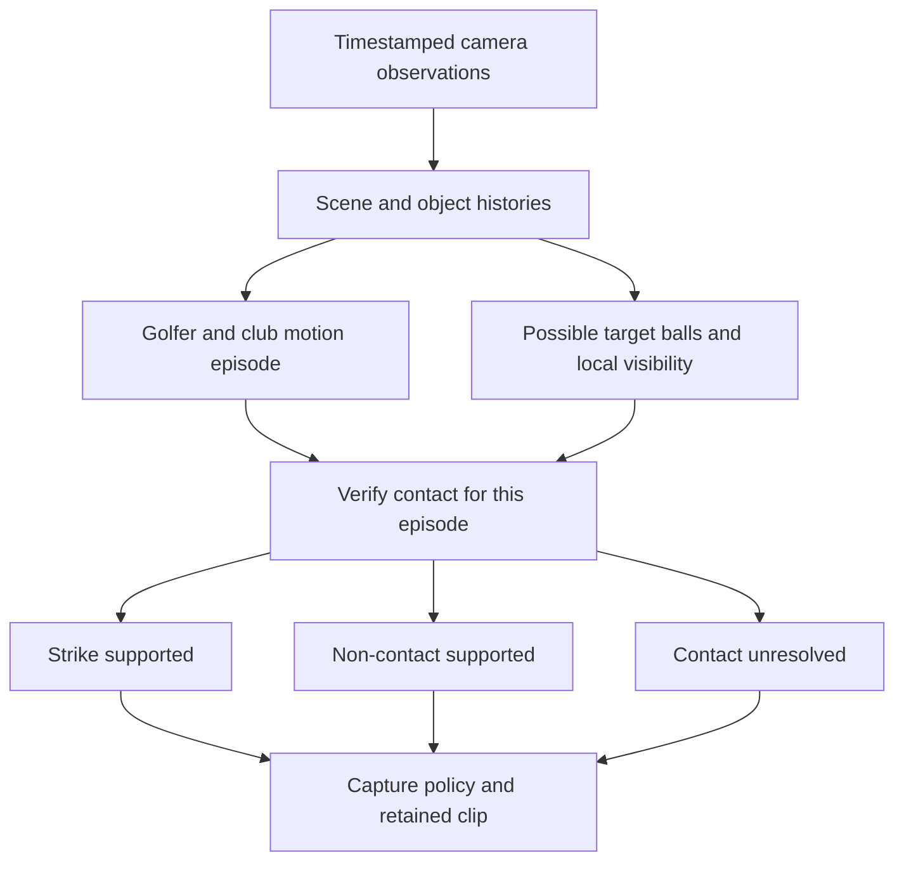

# Reconstructing swing detection around observable evidence

Investigation dated 2026-08-31. The user accepted the reconstruction direction on 2026-09-02. The concrete build and experimentation sequence is in the [reconstruction execution plan](./SWING_DETECTOR_RECONSTRUCTION_EXECUTION.md). No detector, model, capture setting, label, or scoring threshold changed in this design work. The app remains at the 68% baseline. The 65% variant remains an isolated experiment.

I recommend rebuilding the decision core while retaining the existing capture, Core ML integration, replay tools, and useful models. The original idea of watching an addressed ball is sound. The reconstruction should make golfer identity, club identity, target uncertainty, visibility, and the distinction between motion and contact explicit. Another horizontal line cannot supply those missing relationships.

The current detector could serve a controlled prototype with known framing and manual review. The 65% experiment matched 53/54 labelled swings with no extras. That supports continued use as a comparison, not a claim of robust detection across range setups. All ten recordings have informed the design; none is now an untouched validation set. See the [experiment comparison](../detector_workbench/validation/README.md) and [current implementation audit](./SWING_DETECTOR_LOGIC.md).

## What the requirement means

The user requires a golf swing with ball impact, detected during live recording. There are two separate physical claims:

1. This golfer performed a golf stroke with this club.
2. A ball was struck during that stroke.

A practice swing can satisfy the first claim without the second. A golfer nudging a ball into position can satisfy ball contact without performing the stroke we want to capture. A P7-like pose, an impact sound, or a disappearing white object cannot establish both claims alone.

Use a tripod-mounted phone, one intended golfer, continuous capture, and no network dependency as the proposed first operating scope. Multiple visible people and balls still require handling within that scope. Poor visibility must produce an explicit limitation rather than a confident guess. Full range swings are the existing acceptance scope; pitches, chips, putting, and unusual drills need an explicit coverage decision and labels. Their absence of an overhead backswing or held finish must not be described as absence of a golf stroke.

"Real time" should mean a bounded decision after the event while recording continues. Immediate recognition at the exact collision is a different, harder requirement. I suggest evaluating a normal confirmation target within one real second of the strike, with uncertain cases closing as unresolved at a defined deadline. This is a proposed product budget, not an achieved result or a required minimum delay.

## From physical swing to pixels

The camera measures projected appearance over exposure intervals. It does not directly output object identity, depth, intent, or contact. Learned models turn appearance into candidate objects and joints; tracking tests their continuity; event logic tests relationships over time.

| Physical component | Evidence available to the computer | What it does not establish alone |
| --- | --- | --- |
| Setup near a ball | Persistent ball candidate, golfer geometry, club resting near a plausible strike location | The nearest or largest ball is necessarily the intended ball |
| Takeaway and backswing | A coherent club/wrist path moving away from that location | A real shot rather than a rehearsal |
| Return through the strike area | The same club approaching and crossing the local region in temporal order | Depth coincidence or actual club-ball contact |
| Ball response | Previously observed ball leaves its location; a readable patch becomes empty; an attributable outgoing ball may be visible | That any missing model detection means departure |
| Follow-through | Continuation of the same movement, useful for rejecting a nudge and bounding the clip | Contact, or a universal requirement to hold a high finish |

These are useful components, not a rigid sequence of mandatory P1–P10 positions. We do not need to estimate every coaching event to collect a shot. GolfDB itself evaluates event timing within trimmed single-swing clips and notes that exact contact was often between frames in native-30fps footage. [GolfDB paper, sections 3–4](https://arxiv.org/pdf/1903.06528).

Our object model processes a letterboxed 960-square input and returns ball, clubhead, and shaft boxes. It does not identify the golfer's ball or measure a shaft's actual endpoints. A box intersection is a relationship between image regions, not proof of physical contact. Small objects, blur, clothing, and overlapping objects can make the visual evidence ambiguous.

A local pixel comparison or optical-flow tracker can help after locating the relevant region. It must account for camera motion, lighting change, and occlusion. "White pixels disappeared" remains vulnerable to colored balls, white shoes, reflections, and a covered ball. Classical vision is useful measurement machinery, not a replacement for deciding what the measurement means.

## What can be deterministic

A rule engine can produce the same decision from the same ordered observations and configuration. That does not make its observations infallible. Model confidence is not certainty, a tracker can associate the wrong object, and different delivered frames can legitimately change the decision. Cross-device bitwise inference equality is not established by our tests.

There is also an information limit. If the ball and all distinguishing aftermath remain hidden, a strike and a practice swing can produce indistinguishable available images. The correct output is unresolved contact. Calling that a practice swing merely hides a possible missed shot.

At our configured 8/16 analysed frames per real second, nominal intervals are 125/62.5 ms. A captured 240fps recording does not imply 240 detector observations per second. Use timestamps and estimate an impact interval between relevant observations rather than inventing exact collision precision. Pose also carries per-joint uncertainty and requires sufficient visibility. [Apple's body-pose guidance](https://developer.apple.com/documentation/vision/detecting-human-body-poses-in-images).

## What the present code gets right and where it loses information

Retain the shared V2 core for Capture, import and replay; the source-time conversion boundary; the pre-impact recording buffer; state-driven analysis; object-model reuse; and inspectable traces. Preserve the existing club-over-ball protections as requirements, even where the implementation needs replacing.

The following source findings explain what a reconstruction must change. The first three include reproduced failures; the other risks are source findings unless stated otherwise.

| Finding | Evidence and consequence |
| --- | --- |
| Target selection can change during the swing | `SwingDetectorV2.process` permits retargeting in addressed and swinging states. `AddressMonitor.retargetCandidate` heavily favors current clubhead proximity. The no-line runs switch from real targets to background detections; test15 switches to its spare after a false clubhead detection. |
| Unrelated ball counts influence acceptance | `lowStrikeBallCount` counts qualifying balls across the image band. In test4, removing the line changes the inventory contribution and pushes the same candidate from about 0.644 to 0.741, above the 0.74 threshold. |
| Covering can resemble departure | Test11's no-line/60% extra follows a background ball being obscured by the golfer. `PatchObservation` distinguishes club overlap but does not model general target visibility. |
| "Tracker" does not mean persistent club identity | `FrameSampleV2.bestClubPoint` selects the highest-confidence clubhead, or a shaft-box centre. `ClubTracker` connects those points across frames without maintaining a club identity. An apparent trajectory can therefore mix objects or representations. |
| Intended golfer ownership is incomplete | Pose extraction takes the first body observation. Ordinary club/ball association does not use persistent golfer identity, despite collecting wrist and torso fields. |
| Some intended weak-ball evidence never reaches the patch watcher | The decoder discards scores below 0.25, so the patch watcher's declared 0.15 threshold cannot recover them. It filters full-frame detections rather than running a dedicated patch analysis. |
| Dense scenes can lose relevant observations before tracking | The decoder keeps at most 12 ball boxes, and distance-based clusters can merge nearby candidates. A large patch can also overlap a spare. These are risks for marker-ball setups, not newly reproduced failures. |
| Elapsed time can substitute for readable aftermath | Candidate resolution accepts sufficient absent samples **or** elapsed time. Departure scoring falls back to overlapping post frames if there are no non-overlap frames. Thus the intended requirement for clear post-sweep views is not universal. |
| Practice capture conflates a missing contact detection with no contact | The optional pose-pattern path excludes nearby accepted contact detections, then emits the same `DetectedSwing` type with a fixed 0.9 score. It can cover a missed real strike. That number is not a calibrated probability of practice. |
| Playback format changes more than the clock | Slow-drill branches test `sourceTimeScale > 1`. Tempo support should depend on observed movement, not whether equivalent motion arrived as a slow-motion export. |

Sources: [object decoding](../SwingCoach/Models/GolfObjectDetector.swift), [frame features](../SwingCoach/Models/SwingDetectorV2/SwingDetectorV2Frame.swift), [address selection](../SwingCoach/Models/SwingDetectorV2/AddressMonitor.swift), [club evidence](../SwingCoach/Models/SwingDetectorV2/ClubTracker.swift), [patch observation](../SwingCoach/Models/SwingDetectorV2/PatchWatcher.swift), [state machine](../SwingCoach/Models/SwingDetectorV2/SwingStateMachine.swift), and [candidate evaluation](../SwingCoach/Models/SwingDetectorV2/SwingDetectorV2.swift).

The previous restart already proposed locking a patch and collecting evidence. Repeating that diagram is insufficient. The structural changes below prevent later logic from quietly substituting a different golfer, club, target, or kind of evidence.

## Proposed reconstruction

### 1. Preserve observations before making claims

Each observation needs its capture time, coordinate transform, confidence, freshness, and missing-data reason. Keep detection failure, occlusion, skipped inference, and missing camera frames distinct. Do not turn them all into a zero-confidence ball.

Scene state should associate the intended golfer across frames and maintain separate ball and club histories. Use body-relative geometry and local ball size where supported, with uncertainty. Measure distances in a consistent image metric rather than treating separately normalized image width and height as equal physical scales. Pose loss should reduce confidence in an existing association, not transfer it to a neighboring golfer.

Start with simple history-based association where objects are distinguishable. More tracking machinery is justified only by measured failures. Similar balls may be identifiable by location while stationary; after an ambiguous crossing or complete occlusion, admit that identity may be lost.

### 2. Separate possible targets from a committed target

During setup, maintain plausible target histories near the golfer's resting club. Spare and marker balls can remain visible without competing for ownership on every frame. The selection evidence is sustained association with that golfer's club, position relative to the setup, and temporal consistency. It is not simply image height or the largest ball confidence.

When a club covers the intended ball, preserve a provisional strike region. On takeaway, the revealed ball can complete the evidence for that region. This preserves the legitimate reason the current detector permits retargeting. Freezing the first visible spare forever would be another bug.

Once a target is supported, bind its identity and history to the swing episode. A moving club passing near a downrange ball cannot silently replace it. If setup was ambiguous, retain the existing alternatives and uncertainty; do not invent a confident new target during impact. Selecting between alternatives must satisfy the same contact evidence and respect the decision deadline.

The strike location stays attached to the scene, not to moving wrists during the backswing. Small camera motion may be compensated when the scene transform is reliable. A meaningful camera move, zoom, or orientation change invalidates the association and starts a new scene context. An optional user-selected golfer/strike area is a fallback for ambiguity, not proof of contact or a per-video line calibration.

### 3. Recognise a motion episode without requiring a visible ball first

Use coherent movement of the associated club and golfer to identify the stroke interval. Include order and continuity, not just maximum speed or the largest path span anywhere in a window. A history can support takeaway, return, and continuation even if the exact crossing frame was missed.

This stage should still recognise motion when contact cannot be checked. It can serve practice capture and explain "swing seen, ball unclear." Whether to use transparent temporal rules or a small learned sequence model is a measurable implementation choice. Start with the available observations; do not assume a larger model repairs identity or visibility mistakes.

Do not make a high finish, textbook pose, or a fixed swing duration a universal prerequisite. Explicit motion coverage prevents slow drills and short strokes from acquiring unrelated rescue branches.

### 4. Verify the same ball's response

Represent local visibility with at least these states:

| Observation state | Meaning for contact |
| --- | --- |
| Target present | Supports occupancy of the identified location |
| Region readable, target absent | Can support departure when consistent across informative observations |
| Region covered | Neither presence nor departure has been established |
| Region unreadable or observation missing | Insufficient evidence due to blur, exposure, resolution, gaps, or identity ambiguity |

"Readable and empty" needs validated local evidence, not just lack of a YOLO box. Evaluate target-specific detection/tracking and local appearance change first. Add cropped inference or segmentation only if those measurements show the current observations cannot distinguish empty from covered. Do not install a heavy segmentation model by assumption.

For the initial visible-ball path, require a coherent stroke, supported target identity before the candidate, the associated club passing through that region, and convincing readable aftermath. A newly observed outgoing ball is useful corroboration if it originates consistently from that location; a pre-existing downrange ball is not flight evidence. Do not require a visible flight track for every shot.

If the same ball remains at rest after a clear club miss, support a non-contact swing. If the region remains covered or ambiguous through the deadline, close as unresolved. A ball that briefly moves and returns is not automatically practice, so use available intermediate motion too. Never relabel a missed or unobservable real shot as practice just because contact verification failed.

### 5. Make the physical requirements non-compensating

This deliberately revises the old preference for a single flat weighted score. A strong swing arc cannot compensate for not knowing which ball moved. Additional unrelated ball disappearances cannot compensate for a covered target.

Use explicit prerequisites for a supported strike, plus continuous measurements for association quality, ordering, visibility and consistency. Any aggregate confidence must be calibrated on held-out labelled cases. Existing model confidence and weighted evidence scores are measurements to inspect, not probabilities of a true shot.

Thresholds will still exist. The improvement is that each answers a defined measurement question and has an uncertainty margin. Test sensitivity over a range of values and scenes instead of selecting the one number that divides yesterday's recordings correctly.

### 6. Keep recognition separate from saving policy

The internal result should contain the episode identity, motion interval, impact estimate or interval when supported, decision time, contact verdict, evidence references, and unresolved reason. Preserve the distinction between observed and inferred facts.

Real-shot mode saves supported strikes. A practice-enabled mode also saves supported non-contact swings. Unresolved motion could be retained for review without a "confirmed hit" tone, subject to a product decision about library clutter. The toggle changes which outcomes are saved; it does not lower the definition of ball contact.

## Edge cases that define the design

| Situation | Expected reasoning and outcome |
| --- | --- |
| Several balls used as drill markers | Keep separate location histories. Verify the selected target's response; other balls may remain or become covered without deciding the shot. |
| Club covers the target at address | Preserve a provisional region and use the reveal to establish occupancy. Do not choose a spare merely because it is visible. |
| Jumper, logo or shoe resembles a clubhead | Demand continuity and golfer/club association. A one-frame detection must not reassign the target or manufacture a club trajectory. |
| Practice swing beside a stationary ball | Recognise motion. A clearly observed miss and unchanged target support non-contact. |
| Practice swing with no ball | Recognise supported club/golfer motion in a readable scene; optional practice mode can retain it. An obscured strike area remains unresolved. |
| Leg, club, bag or another person covers the region | Retain identity where justified; wait for informative views within the deadline. Persistent ambiguity becomes unresolved. |
| Neighbor hits at the same time | Other golfer motion and audio cannot supply contact evidence for this episode. |
| Ball is repositioned or knocked accidentally | Ball motion alone is not the intended golf stroke. Check the associated movement and temporal order. |
| A marker ball is actually struck during a stroke | Physical contact occurred. The user's intention cannot be inferred from the ball being called a marker; record attributable contact rather than treating all marker motion as impossible. |
| New ball placed at a new location | Start a fresh target history after the previous episode. Do not require the old pixel position. |
| Camera moves or subject leaves | Invalidate unreliable geometry. Do not turn camera-induced movement into a swing or departure. |
| Recording starts mid-swing or stops before confirmation | Use the same evidence rules with incomplete history. Confirm only if sufficient evidence exists; otherwise retain an incomplete/unresolved result. |
| Chips, putts, pauses or abbreviated finish | Apply declared motion coverage. Do not force all golf strokes into the full-swing pattern. |

## Real-time execution and the event model

Keep recording and inference separate. The current Capture delegate forwards recording frames to a writer queue and coalesces analysis backlog to the newest pending frame. V2 then applies timestamp-based sampling. Imported replay processes frames without reproducing that same live contention. Therefore, sharing the core is necessary but insufficient for live equivalence. [Capture implementation](../SwingCoach/CaptureView.swift), [asset replay](https://github.com/ruari8/SwingCoach/blob/73cd63bd2d25c30d62f43e8aae86afc07865dd06/SwingCoach/Models/SwingDetectorV2AssetDetector.swift).

Use bounded work queues and timestamped observation batches. If pose, objects and local tracking run at different rates, include their age and coordinate context when combining them. Boost observations around a supported approach to impact while protecting the recording path. If processing falls behind, preserve the missing-evidence state rather than assuming intervening frames showed an empty patch. Apple documents both dropped-frame timestamps and discontinuities. [Apple TN2445](https://developer.apple.com/library/archive/technotes/tn2445/_index.html).

The current traces grow for the session even though the feature list is capped. A reconstruction should keep bounded feature/episode state and stream optional diagnostics to disk. Audit writer backpressure too; the encoder and inference both compete for resources and camera buffers. Measure capture gaps, analysis skips, processing percentiles, observation age, temperature/pressure, decision delay, and saved-clip completeness on the intended phone. Average laptop processing time is not this measurement.

The 65% artifacts show declarations 0.25–0.333 real seconds after their **estimated** impacts. This calculation uses saved replay timestamps, not measured phone latency or physical impact error. The ten supplied recordings total about 45.6 minutes of real movement time, which is limited evidence for long-session false-positive behavior.

Our test15 P7 proposal used the sibling repository's TCN with symmetric temporal convolutions, normalization over the input sequence, window-level feature preparation, and overlapping four-second windows. It also used separate club feature extraction. Its success is useful for labels and swing timing, but does not show that the current live model inputs reproduce those results. Changing convolution padding alone would not remove the other future-context dependencies. A causal replacement or an explicitly delayed trailing-window model needs its own training/input contract and evaluation. See the [primary-source and local-model research](./research/swing-detector-realtime-evidence.md).

Audio can be evaluated later as corroboration for a visually attributable stroke, especially when it adds information during brief covering. It must distinguish neighboring impacts, mat contact, wind and playback artifacts sufficiently for its role. Current V2 supplies `nil` audio evidence. Capture has a microphone input, but the custom auto rolling writer shown in `CaptureView.swift` creates a video track only. Audio use requires actual timestamped audio delivery, recording/replay support and validation; it is not an available signal merely because an evidence field exists.

## Alternatives and an incremental route

| Approach | Assessment |
| --- | --- |
| Keep the detector and use 65% | Reasonable controlled-prototype option after explicit adoption and phone checks. It leaves the demonstrated target error and framing dependence. |
| Rebuild with only pixel differencing and geometry | Potentially cheap locally, but semantic ambiguity, blur and occlusion remain. Use these tools for measurements rather than expecting a universal white-ball rule. |
| Existing models plus explicit histories and contact verification | Recommended. Preserves useful investment and gives each failure an identifiable layer. It still needs uncertainty handling, better observations where necessary, and validation. |
| Train an end-to-end shot classifier or port P7 as the decision | Worth comparing once labelled continuous negatives and a live timing contract exist. Current P7 success is insufficient evidence for contact attribution or continuous precision. |

The proposed delivery sequence is:

1. **Define the evaluation contract.** Decide supported stroke families, normal confirmation delay, and treatment of unresolved motion. Freeze the four existing experiment results and labels. Add target, club and visibility annotations around failures, not just impact timestamps.
2. **Make the observations replayable.** Record timestamped object/pose outputs, filtering decisions, scene transforms, sample gaps and quality. Existing result files do not contain every raw observation. Capture at an adequate fixed diagnostic cadence so one candidate scheduler's missing samples do not silently constrain all competitors.
3. **Build target and visibility reasoning in isolation.** Replay the existing model observations before changing weights. Prove correct handling of spare balls, covered-then-revealed targets, background club crossings and camera movement. Perfect synthetic observations can test logic invariants; real frames must test whether those observations can be obtained.
4. **Add motion episodes and contact outcomes.** Replace target-switching/score interactions with the common episode verifier. Exercise real shots, practice swings, repositioning, partial starts and missing aftermath. Compare on every current fixture, keeping 54/54 with no extras as the desired regression result; unresolved real shots remain misses, not renamed successes.
5. **Improve only the measured weak observation layer.** Compare local tracking, crop inference, object-model hard-negative training, a temporal motion model, or audio where failures justify them. Freeze the decision logic for each comparison so gains can be attributed.
6. **Run live and held-out acceptance.** Use fresh sessions with different framing, marker layouts, golfers, lighting and shot types. Keep all crops from one source session in the same split. Then check on the actual phone during sustained recording and saving. Do not promote a detector on laptop replay alone.

Ablations should answer whether target history, visibility, golfer association and any extra model actually help. Deliberately reframe existing footage as a regression test and record whether the target remains readable; this cannot replace genuinely new camera views. Replay dropped-frame and pose-loss patterns, test equivalent real-time/slow-motion timelines, and check that extra future footage cannot change an already-final result under the chosen finality contract.

Report contact recall, false captures per hour and per negative activity, non-contact accuracy, unresolved rate, target switches, impact timing against label uncertainty, decision-delay percentiles, and retained-clip completeness. Report supported-view recall separately from total real-shot recall so abstention cannot hide poor capture coverage. The current roughly labelled originals are suitable for collection regression; their generous matching tolerance is not evidence of precise impact localization.

## Integration consequences and evidence

This should replace related contracts together, not add a parallel pile of fallback branches:

- The shared detector interface, output type, Capture status, practice policy, Trim and Debug must preserve contact verdict and uncertainty instead of flattening every motion into `DetectedSwing`.
- Scene/target history belongs to the detector core; camera acquisition supplies timestamps and quality rather than choosing a ball in UI code.
- Adaptive clip windows and longer decision delay require checking rolling-buffer retention and chunk boundaries. The current writer uses 20-second chunks starting every 17.4 seconds; an arbitrarily longer clip is not guaranteed to fit a single chunk.
- Live time remains real elapsed time. Slow-motion imports map source timestamps once; no movement rule should use playback stretching as a proxy for swing style.
- Keep experimental implementations and evidence separate until the selected approach passes. Update the current implementation documentation and remove superseded internal paths when it is adopted. Do not erase the historical V2 design or baseline comparison.

Reviewed source includes every file in `SwingCoach/Models/SwingDetectorV2`, object decoding, the shared detector/output types, Capture scheduling and rolling recording, asset and Debug replay, evaluator matching, and the actual test15 event-model proposal. No full inference suite or phone session was run for this design investigation. Local source hashes and calculations from saved results are in `.verification-artifacts/detector-reconstruction/20260831/audit-evidence.json`. External limitations and model causality are documented in [the research note](./research/swing-detector-realtime-evidence.md).
