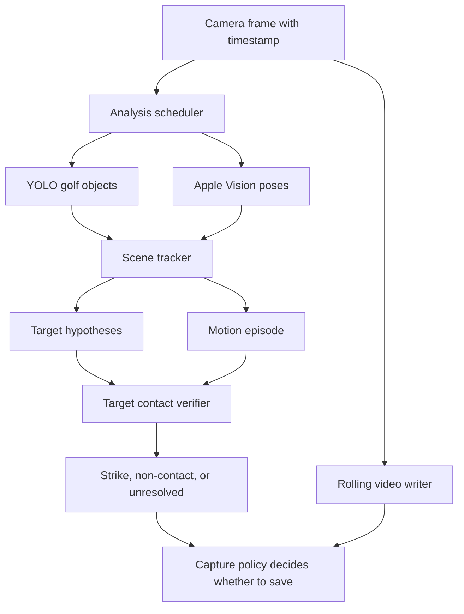

# Swing detector reconstruction execution plan

Status: implemented on 2026-09-02. The [reconstruction proposal](./SWING_DETECTOR_RECONSTRUCTION.md) defines the physical and product rules. The resulting [SwingDetectorV3](./SWING_DETECTOR_V3.md) is app-wired and passes the 54-swing regression gate with zero extras. This document preserves the planned build sequence and experiments.

## The decision

Build a new `SwingDetectorV3` decision core beside V2 for offline development. Reuse the existing camera, rolling video buffer, replay path, object model and Apple Vision pose extraction. Replace V2's address selection, loose per-frame club path, global ball inventory and flat acceptance score with explicit scene histories, immutable swing episodes and target-specific contact outcomes.

The first V3 will **not** require a newly trained model and will **not** use the current TCN to accept shots. It will use:

1. `SwingObjectsYOLO11n` for generic ball, clubhead and shaft observations.
2. Apple Vision body pose for golfer location, wrists and torso scale.
3. Deterministic temporal association to build golfer, club and ball histories.
4. A local target-region observer, initially using existing detections plus source-pixel change and visibility checks.
5. Transparent motion-episode rules for club movement away from and back through the target region.
6. A contact verifier that returns `strikeSupported`, `nonContactSupported` or `unresolved`.

In parallel with that build, run a bounded experiment on the existing P1-P10 TCN. The experiment decides whether a causal or delayed P7 signal is useful enough to add later. The TCN is an optional motion-timing input. It cannot prove ball contact and is not a prerequisite for the first integrated V3.

Do not train a new model before these components reveal a specific observation failure. A later model must have one named job, such as rejecting false clubheads, classifying target-region visibility, or estimating P7 with bounded delay.

## What happens while recording

The camera continues writing every delivered frame to the rolling video buffer at the selected capture rate. Analysis samples that stream; it does not run all models at 120 or 240fps.



These are logically parallel evidence paths. They need not run simultaneously on the same device resources. The scheduler owns when each extractor runs and records the age of every observation it combines.

The intended runtime sequence is:

### 1. Scanning

- Analyse roughly 8 frames per real second with the existing object model and pose request.
- Track every credible golfer, club observation and ball candidate. Do not discard a ball because it sits above a full-image percentage.
- Keep separate histories for stationary ball locations. Several marker balls are normal scene state.
- Search for a persistent relationship between one golfer, a club near that golfer's wrists and one or more stable balls near the club at setup.

No swing decision is possible yet. A single clubhead detection beside a ball creates an observation, not an address lock.

### 2. Prepared

- Enter `prepared` when the same golfer, club relationship and plausible target set persist long enough to represent setup.
- Keep a small set of plausible targets when the club covers the likely ball or two balls remain ambiguous.
- Record clean target crops, local background, target size and visibility history for each plausible target.
- Continue low-rate model inference. Cheap local image measurements may run more frequently if profiling shows they do not interfere with recording.

The target relationship is based on sustained geometry in isotropic image pixels or torso-scaled units. It uses ball stability, distance from the tracked golfer's setup region and repeated club association. It does not use the old 68% line as proof and does not choose the highest-confidence ball each frame.

### 3. Swing starts

- Detect the associated club leaving the prepared strike region with coherent golfer/club movement.
- Create an immutable `SwingEpisode` containing the golfer ID, club history and the prepared target set. The episode may narrow that existing set, but it cannot acquire a newly seen downrange ball.
- Increase object and pose analysis toward the current 16fps burst target. Profile 24fps as an experiment rather than assuming it fits the phone budget.
- Keep the rolling recorder independent at the selected capture rate.

The initial motion detector uses ordered observations: club near setup, club moves away with a credible path, then approaches the local region again and continues beyond it. It does not require a textbook high finish or every P-position.

### 4. Possible impact

- Open a contact-verification window when the associated club returns through or very near a frozen target region during the same motion episode.
- Treat this as an estimated impact interval. The exact collision frame is not required.
- Continue observing only the prepared target set. Other balls may disappear, become covered or move without contributing to this candidate.

The future TCN may sharpen this timing by providing a P7 likelihood for the active motion episode. It would not create the candidate on its own or select a ball.

### 5. Verify the target response

For each frozen target, classify post-candidate observations as:

- `present`: the matched ball remains at its location;
- `readableEmpty`: the local region is visible and consistently no longer contains that ball;
- `covered`: club, golfer or foreground motion prevents inspection;
- `unreadable`: blur, exposure change, camera movement, inference gaps or poor resolution make the result unreliable.

The first implementation combines the existing ball boxes with a tightly scaled source-pixel crop. It compares target occupancy and local appearance across time, compensates for small scene motion, and requires several informative post-candidate observations. Missing a YOLO box does not by itself produce `readableEmpty`.

If source-pixel evidence cannot reliably distinguish empty from covered, stop and compare two focused improvements: re-running the existing object model on the crop, or training a small target-visibility classifier. Do not add both before measuring them.

### 6. Decide and save

- Coherent motion, an associated club crossing and target-specific readable departure produce `strikeSupported`.
- Coherent motion plus a clearly readable target that remains stationary produces `nonContactSupported`.
- Coherent motion with inadequate target identity or visibility produces `unresolved`.
- Ball movement without a coherent stroke is ignored as repositioning or incidental contact.

Real-shot capture saves only `strikeSupported`. Practice-enabled capture also saves `nonContactSupported`. We should initially retain unresolved episodes in debug output, not the golfer's library. That policy can change later without changing the definition of contact.

A proposed normal decision deadline is one real second after the estimated impact interval. Most clear cases should resolve sooner. Phone measurement, not this document, decides the final budget.

## How relationships are decided

V3 needs histories with identity. It should not expose vendor observations directly to the decision engine.

### Golfer history

Process all body-pose results rather than taking only the first. Associate a pose with an existing golfer using predicted hip/torso position, body scale and overlap with its recent region. Keep the identity through short pose gaps. A nearby person cannot become the episode's golfer after the swing begins.

The intended golfer is the one that develops the persistent setup relationship. If two golfers remain equally plausible, target ownership is unresolved. A later optional UI fallback could let the user select a golfer or hitting region.

### Club history

Treat clubhead and shaft detections as observations of one possible club, not interchangeable points selected solely by confidence. Associate them using:

- continuity from recent club position and plausible speed;
- proximity to the tracked golfer's wrists;
- consistency between clubhead and shaft regions when both exist;
- relationship to the prepared target during setup.

One-frame clothing or logo detections should fail continuity or golfer/shaft consistency. If a false detection persists coherently enough to pass, that is an object-model hard negative to label rather than a reason to transfer the target mid-swing.

### Ball histories

Associate ball detections across frames with a one-to-one assignment based on predicted position, size and time gap. Stationary tracks should stay tightly localized. Uncertainty expands during a missed observation; it does not teleport the track to a new high-confidence ball.

Several ball histories may exist. `TargetSelector` ranks their relationship to the golfer and resting club over a window. It retains alternatives where the evidence is close. Once a swing starts, the episode freezes those existing histories and rejects new target membership.

### Scene motion and visibility

Estimate whether stable background points moved together. Small reliable motion updates the target regions. A large or unreliable transform creates a new scene epoch and invalidates prepared relationships.

Visibility is separate from ball presence. Club overlap, body proximity, strong local foreground change, capture gaps and blur can make the region covered or unreadable. Only stable informative observations can support an empty location.

## Proposed modules and ownership

Create an experimental `SwingDetectorV3` module. Do not retrofit these rules into V2 while trying to preserve its state shape.

| Module | Owns |
| --- | --- |
| `SwingObservationExtractor` | Converts Core ML, Vision, timestamps and frame quality into vendor-neutral observations. |
| `SceneTracker` | Golfer, club and ball IDs; one-to-one association; scene epochs and coordinate transforms. |
| `TargetSelector` | Prepared target hypotheses and the evidence that supports each one. |
| `MotionEpisodeDetector` | Ordered golfer/club motion and immutable `SwingEpisode` creation. |
| `TargetRegionObserver` | Target crops and `present/readableEmpty/covered/unreadable` observations. |
| `ContactVerifier` | Contact outcome for a fixed episode and target set. It is the only module allowed to claim contact. |
| `SwingDecisionEngine` | State progression, scheduling requests, deadlines, duplicate control and emitted outcomes. |
| `SwingDetectorV3` | Coordinates raw-frame adapters and the decision engine. It is the live/import caller boundary. |
| `SwingCapturePolicy` | Maps outcomes plus the practice toggle to clips saved by the app. It never changes contact evidence. |

The caller should remain simple:

```swift
let result = detector.process(frame)
for event in result.events {
    capturePolicy.handle(event, rollingBuffer: buffer)
}
```

Inside `SwingDetectorV3`, the engine requests the observations needed for its current state. The adapters run object/pose inference and any requested target crops, then deliver one ordered batch to the engine. Offline unit tests can bypass pixels and feed `SwingObservationBatch` directly. This keeps AVFoundation and Vision outside the decision rules without requiring the Capture caller to coordinate internal steps.

Important domain shapes are:

```text
SwingObservationBatch
  timestamp, sceneQuality, poses, golfObjects, targetRegions, missingEvidence

PreparedTargetSet
  sceneEpoch, golferID, clubRelationship, existingBallHypotheses

SwingEpisode
  episodeID, sceneEpoch, golferID, preparedTargets, motionInterval

ContactOutcome
  strikeSupported | nonContactSupported | unresolved(reason)

SwingDetectionEvent
  episode, contactOutcome, impactInterval?, declaredAt, evidenceReferences
```

This makes it difficult to express the current failure where a new ball becomes the target during the swing. `SwingEpisode` contains prepared target identities, not a mutable optional centre point.

## What we will do with the TCN

The existing event research justifies an experiment. It does not yet justify a product dependency.

The strongest sibling-repository TCN reports high P7 timing accuracy on its event test set, and the separate Apple-Vision/club checkpoint proposed all three reviewed test15 impacts. That is meaningful signal. However, the exact test15 process used overlapping four-second windows, symmetric temporal convolutions, sequence-wide normalization and future-bounded club interpolation. It also used `club_seg_v2_960` features, not the app's `SwingObjectsYOLO11n` output. Its scores were never calibrated as continuous shot probabilities.

Run an **online-prefix experiment** before V3 depends on it:

1. At each historical time `t`, provide only observations available at or before `t`.
2. Measure when each P7 estimate first appears and when it stops moving.
3. Evaluate confirmation delays of 0.25, 0.5, 0.75 and 1.0 real seconds.
4. Run the same method over long continuous recordings, pre-shot rehearsals and practice swings. Report duplicate peaks and false P7 peaks per hour.
5. Record the exact pose and club-feature cost. Do not substitute app YOLO features into a checkpoint trained on segmentation features and call it parity.

There are three possible results:

| Result | Decision |
| --- | --- |
| Stable P7 within the delay budget and exact features fit the phone | Add it later as `MotionTimingObservation`, still subordinate to contact verification. |
| P7 signal is valuable but the current model uses too much future context or compute | Train a causal or fixed-lookahead event model using the existing event labels, then repeat continuous-negative and phone tests. |
| It adds little beyond transparent motion episodes | Leave it out of capture. Continue using it for offline event labels and coaching checkpoints. |

Do not train that causal model merely to begin V3. Event labels can supervise P7 timing, but continuous practice and no-swing footage are still needed to evaluate live peak creation. The relationship and contact layers remain necessary in every result.

## When new training becomes justified

No new training is planned for the first two build milestones. Use errors to select one of these later jobs:

| Measured failure | Candidate response |
| --- | --- |
| Clothing, logos or mats repeatedly become coherent clubs or balls | Add reviewed hard negatives and fine-tune the existing golf-object model. |
| Source crops are visible but rule-based occupancy cannot distinguish ball present from empty | Train a small target-region visibility/occupancy model. |
| Motion episodes miss valid strokes or accept repeated non-stroke movement despite correct tracks | Evaluate the TCN result; train a causal motion/event model only if it improves this layer. |
| Brief covering remains the only missing contact evidence | Evaluate timestamped audio as corroboration after adding audio to the rolling and replay paths. |

An end-to-end "shot/no shot" video model is not the next training task. It would hide which golfer, club or ball caused its answer and would need far more reviewed continuous negatives.

## Execution sequence and stop conditions

### V3-0: Replayable observations

Build the vendor-neutral observation types, multi-person extraction, timestamps, quality/gap reporting and a replayable observation log. Extend the evaluator so model inference and decision replay can be inspected separately.

Gate:

- every observation identifies its source time, coordinate space, model and freshness;
- all current fixtures can be replayed without changing labels;
- dropped or intentionally skipped frames remain gaps rather than empty observations;
- no V3 shot decisions exist yet.

### V3-1: Scene relationships

Annotate focused windows from test15, test7, test11 and test4 with the intended golfer, real target, spare/background balls, club observations and target visibility. Build `SceneTracker`, `TargetSelector` and scene-motion handling.

Gate:

- the real target remains among the prepared hypotheses in every reviewed real-shot window;
- test15 swing two does not transfer to its spare;
- the reviewed test7/test11 background balls do not become swing-episode targets;
- every identity change or unresolved association has a traceable reason.

If current observations cannot meet the gate, improve the relevant extractor before adding contact scoring.

### TCN-0: Online timing spike

Run the prefix experiment independently once V3-0 provides consistent timestamps. This work may proceed beside V3-1 because neither changes product decisions.

Gate for considering integration:

- report earliest stable P7 delay on reviewed event clips and test15;
- report continuous-session duplicate/false peaks;
- preserve exact feature compatibility;
- profile the exported Core ML model and its feature extractors on the intended phone.

Failure means V3 continues without the TCN.

### V3-2: Motion and target response

Build immutable `SwingEpisode`, target-region observation and explicit contact outcomes. Test target response with known motion timing first, then add the transparent motion-episode detector.

Gate:

- each of the 54 current real-shot labels resolves as `strikeSupported` at the desired regression target, with zero extras;
- existing hard negatives produce no supported strike;
- practice and covered-target examples produce the correct non-contact or unresolved outcome;
- unrelated ball disappearance never contributes to a candidate;
- failures name the wrong observation or relationship rather than a final score alone.

An unresolved labelled real shot remains a miss. It cannot be counted as practice or success.

### V3-3: Fresh data and decision freeze

Add genuinely unseen sessions with changed framing, several marker balls, practice swings, waggles, repositioning, walk-ins, neighboring golfers and temporary covering. Keep all footage from one session in one data split.

Gate:

- evaluate supported-strike recall, false captures per hour, unresolved rate and target-switch count on held-out sessions;
- freeze the decision rules before the final phone acceptance run;
- do not tune on the held-out result and report it as validation.

### V3-4: Live phone acceptance and app migration

Run Capture on the intended iPhone while recording and saving. Measure analysis p50/p95 time, observation age, coalesced/dropped frames, decision delay, thermal/pressure behavior and saved-clip completeness.

Initial performance questions:

- can the 16fps burst path remain within its 62.5ms frame budget at p95;
- does analysis lag remain bounded during a sustained session;
- do supported strikes normally resolve within the agreed delay budget;
- does the rolling buffer retain the requested pre/post window at chunk boundaries.

After the gates pass, migrate Capture, Trim and Debug to V3 together, update the output type and practice policy, then remove V2 from product call sites. Keep V2 only as historical comparison until that migration is verified.

## What is fixed and what remains fluid

Fixed unless new evidence disproves the reconstruction:

- contact is target-specific;
- a swing episode cannot acquire a new target mid-swing;
- missing or covered evidence is not departure;
- motion and contact have separate outcomes;
- practice mode changes saving policy, not contact truth;
- no new model is trained without a measured job.

Fluid and decided by experiments:

- exact association costs and uncertainty windows;
- whether source-pixel rules, crop inference or a small classifier best reports target visibility;
- whether the burst target remains 16fps or can safely increase;
- whether the existing TCN, a causal retrain or no event model is used in live capture;
- the final confirmation deadline and unresolved-library policy.

The first work item is therefore V3-0 plus the focused relationship/visibility annotations needed by V3-1. The first model experiment is TCN-0. Neither requires changing the shipping detector.
